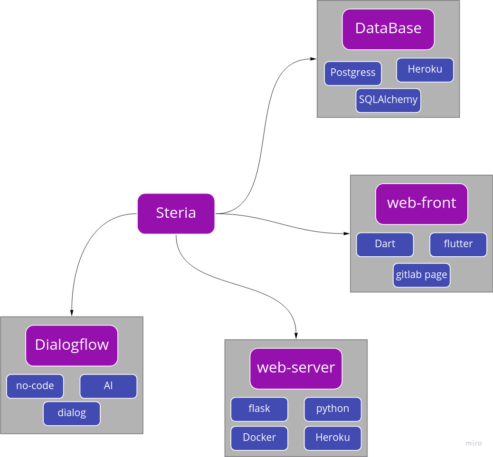

[Назад](README.md) | [Главная](../README.md) 
---

Steria - это приложение позволяющее получить информацию о 
 историческом здании или сооружении в Санкт-Петербурге. 
 Информация о зданиях берется с сайта [carto](https://nslavin.carto.com/tables/how_old_is_this_house_1005/public/map).
 
## Компоненты

Система состоит из нескольких компонентов:  
 - веб-сервера(web-server)  
 - клиентов  
    - Мобильная веб-страница (web-front)  
    - Голосовые ассистенты или мессенджеры (Dialogflow)  

### `Web-server`

Обрабатывает запросы клиентов и возвращает 
 информацию о здании. Клиентами могут выступать 
 платформа для понимания естественного языка (`Dialogflow`) и 
 мобильный веб-сайт(`web-front`). Для работы с клиентами 
 реализованы соответствующие интерфейсы, которые общаются с 
 модулем обработки бизнес логики.
 
Сервер асинхронный и развернут в `Docker`.

Состоит из трех компонентов: 
 - Dialog-interface
 - Front-interface
 - Core

#### `Dialog-interface`
Обрабатывает запросы с `dialogflow` в формате 
 `json` (API-Dialogflow). Основное назначение получить в 
 параметрах адрес и вернуть данные полученные из core.

#### `Front-interface`
Специальный API для работы с мобильной версией сайта. 
 Обрабатывает GET запрос с параметрами и возвращает 
 полученную информацию.

#### `Core`
Взаимодействует с внешней системой для получения 
 информации о здании.

